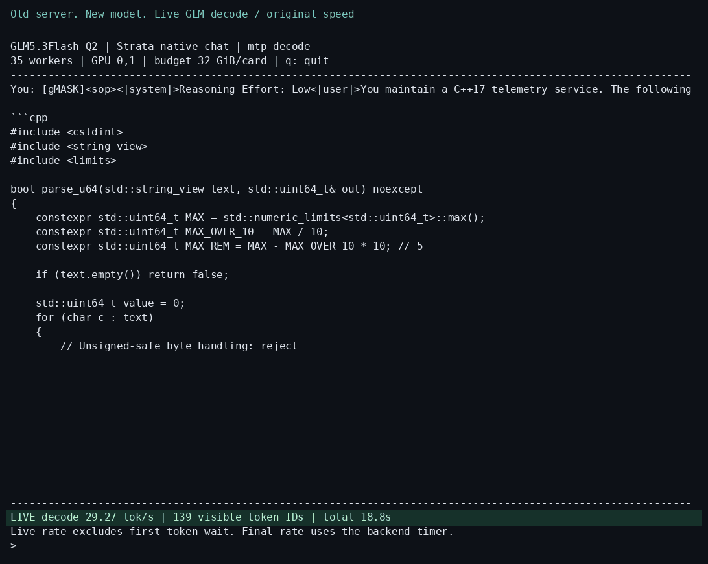
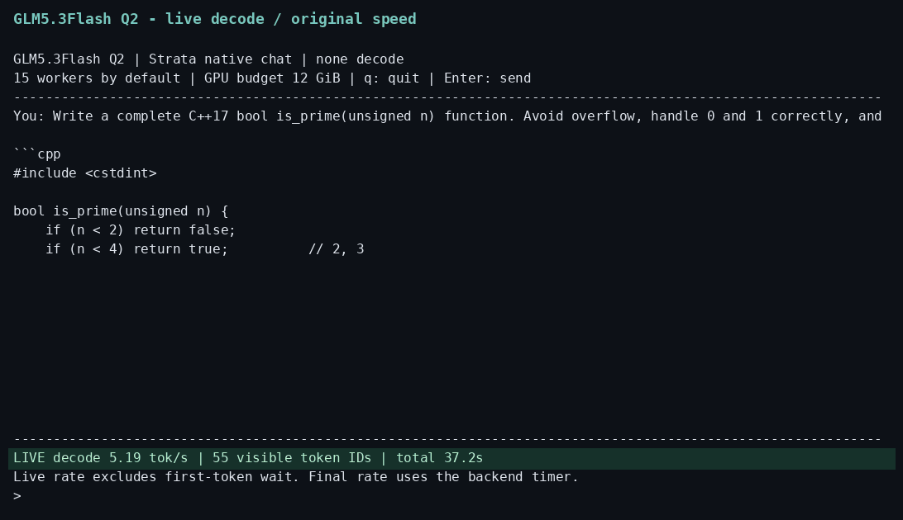

# Strata-GLM53F: GLM-5.3-Flash on desktops and budget servers

This fork adds an experimental native GGUF backend for **GLM-5.3-Flash**, running the mixed **Q2_K_XL** model on a **Threadripper 1950X, 160 GB DDR4 and RTX 5060 Ti 16 GB**. Fixed layers and batched prefill run on the GPU; routed decode experts run directly from RAM on the CPU, with optional GPU MTP drafting.

<p align="center">
<a href="docs/media/glm53-v100-live-decode.gif"></a>
<a href="docs/media/glm53-live-decode.gif"></a>
</p>

**Old server. New model. ~29 tok/s.** Server on the left, Threadripper desktop on the right; on narrow screens, server above desktop. Click either animation to view it at full size. Both eight-second clips play at original speed with loading and prefill omitted.

- **Server — ~29 decode tok/s:** 2017-era Volta architecture, 2019 Xeon Gold 6240 CPUs, 160 GiB RAM and 2× Tesla V100 PCIe 32 GB. The 4K C++ benchmark measured **29.06 tok/s median**; the live capture measured **28.17 tok/s** over 512 tokens with MTP depth 1 and 35 CPU workers. Warmup is omitted from playback. [Hardware measurements](docs/GLM53_V100.md) · [Demo timing](demos/glm53_chat/v100_measurement.json).
- **Threadripper desktop — ~7 decode tok/s:** Threadripper 1950X (16 cores), 160 GB DDR4 and RTX 5060 Ti 16 GB; 15 CPU workers, single decode, 12 GiB GPU budget. This short C++ demo measured **7.51 tok/s**. [Desktop measurements](docs/README_GLM53_FLASH.md) · [Demo timing](demos/glm53_chat/measurement.json).

- **Initial short-chat decode: 7.33 tok/s median** (7.324, 7.334, 7.327), with identical outputs across three single-decode trials. The earlier source-prefix benchmark reached 7.54 tok/s with GPU MTP depth 1.
- **C++ output validation:** a 4,096-token chat prompt and 512-token generation cap produced two complete, coherent answers. Each generated C++17 function compiled and passed **400,532 test cases** under ASan/UBSan.
- **Initial 4K C++ decode: 7.26 tok/s single, 8.35 tok/s GPU MTP**, medians of three trials each. Outputs matched across all six runs, ending at 393 tokens including stop.
- **Initial warm 4K prefill: 98.29 tok/s at batch 2048; 158.25 tok/s at batch 4096**, medians of three trials after an untimed warmup.
- **Desktop memory budget:** 12 GiB total GPU budget, with a physical free-memory guard to leave room for the display and other apps.

Read the **[GLM5.3Flash guide: setup, measurements and hardware upgrade scenarios](docs/README_GLM53_FLASH.md)**, the **[C++ validation report and generated code](docs/fixtures/glm53_cpp_quality/README.md)**, and the **[full performance record](docs/GLM53_FLASH_PERFORMANCE.md)**. Earlier Q3 prefill reached 112.4 tok/s on a different benchmark; rates vary with the prompt, quantization and configuration.

For a live terminal demonstration, use the [simple ASCII chat with a decode-speed counter](demos/glm53_chat/README.md).

## Original Strata README: Qwen3.8-Flash-Next

The existing README is preserved below. Its Qwen installation flow, performance claims and model requirements describe the original engine. Use the GLM guide above for this fork's current GLM configuration and results.

---

<h1 align="center">Strata</h1>

<p align="center"><b>Run a 125-billion-parameter AI model on your own gaming PC</b><br>
NVIDIA or AMD graphics card (12 GB or more) · Windows or Linux · free and open source</p>

<p align="center"><a href="https://github.com/Niko1221/Strata/releases/download/v0.1.10/Pagoda.mp4"></a><br>
<sub>A voxel pagoda garden, 1 shot prompt running on an RTX 5070 with Strata (IQ3_S, 128K context) ·
<a href="https://github.com/Niko1221/Strata/releases/download/v0.1.10/Pagoda.mp4">full video (49 s)</a></sub></p>

Strata runs **[Qwen3.8-Flash-Next](https://huggingface.co/Qwen/Qwen3.8-Flash-Next)** - a large, smart AI model that
normally needs a server - on a normal PC. It chats, writes code, reads pictures and works with your apps and coding
agents, and nothing leaves your PC.

An experimental native GGUF backend for **GLM-5.3-Flash** is available for CUDA builds.
See [build instructions and measurements](docs/README_GLM53_FLASH.md).

## How fast is it?

Measured on two ordinary gaming PCs. "Writes answers" is how fast the reply appears in a short chat; "reads your
prompt" is how fast it takes in what you send (a 32K-token document, code or chat history). A token is about ¾ of a
word, so 60 tokens per second is faster than you can read.

<table>
<tr><th>NVIDIA: RTX 5070 (12 GB), Ryzen 5 7600, 64 GB RAM</th><th>AMD: RX 9070 XT (16 GB), Ryzen 9 3900X, 47 GB RAM</th></tr>
<tr><td>

| Size | Writes answers | Reads your prompt |
| --- | ---: | ---: |
| **Q2_0** | 94 tokens/s | 2,650 tokens/s |
| **IQ2_XS** | 79 tokens/s | 2,090 tokens/s |
| **IQ3_XXS** | 62 tokens/s | 1,750 tokens/s |
| **IQ3_S** | 53 tokens/s | 1,620 tokens/s |
| **Coder** | 55 tokens/s | 2,180 tokens/s |

</td><td>

| Size | Writes answers | Reads your prompt |
| --- | ---: | ---: |
| **Q2_0** | 60 tokens/s | 1,160 tokens/s |
| **IQ2_XS** | 52 tokens/s | 1,110 tokens/s |
| **Coder** | 44 tokens/s | 1,420 tokens/s |

</td></tr>
</table>

A card with more VRAM is faster: an RTX 3090 (24 GB) should write roughly 100-140 tokens per second. Long chats,
other cards: [speed of each model](docs/MODELS.md#how-fast-is-each-size), [community results](docs/COMMUNITY_BENCHMARKS.md).

<p align="center"><a href="https://buymeacoffee.com/strataengine"></a><br>
<sub>Strata is free. If it runs well on your PC, a coffee keeps the work on it going.</sub></p>

## What you need

| | |
| --- | --- |
| **Graphics card** | **NVIDIA** GeForce RTX 20, 30, 40 or 50 series, or **AMD** Radeon RX 7900 XT / XTX, RX 7800 XT / 7700 XT, RX 9060 XT, RX 9070 / 9070 XT, Radeon AI PRO R9700 or RX 6800 / 6900 series - with **12 GB of VRAM or more** |
| **RAM** | 32 GB or more - how much decides [which model](#which-model-should-i-pick) fits; 64 GB runs every size |
| **Disk** | about 80 GB free, on an SSD if you can (the first start is much faster) |
| **System** | Windows 10 / 11 or Linux, and a current graphics driver from NVIDIA or AMD |

Everything else is installed for you. Two or three cards can share the model ([multi-GPU](docs/MULTI_GPU.md)).
The full list: [docs/INSTALL.md](docs/INSTALL.md#what-you-need).

## Install

### Let your AI set it up

Use an AI coding assistant (Claude Code, Cursor, Codex, GitHub Copilot, ...)? Paste this into it:

```text
Set up Strata on this PC for me: https://github.com/Niko1221/Strata - follow docs/AI_SETUP.md in that repository.
```

It checks your graphics card, RAM and disk, picks the model that fits, installs it, starts it and tells you how to
connect your apps. AI tools can also install, start and stop Strata themselves through its
[MCP server](docs/MCP_SERVER.md).

### Or do it yourself

[Download Strata](https://github.com/Niko1221/Strata/archive/refs/heads/main.zip) and unzip it (or `git clone` it).
**Windows:** double-click **`START-HERE.bat`**. **Linux:** run **`./setup.sh`** in the Strata folder.

The same steps for NVIDIA and AMD: the installer finds your card and sets up the right engine for it. It asks which
model, which size, how much context (how much text it keeps in mind) and whether it should read pictures - press
Enter each time for the recommended answer. Then it downloads the model (~70 GB; you can stop and it continues where
it left off) and starts it. Your browser opens the Strata app at `http://127.0.0.1:8080`.

> **While the model starts, your PC can be slow or stop responding for 1-3 minutes** (longest the first time): Strata
> loads 35-55 GB into your RAM and locks part of it for the graphics card. That's normal - wait, and don't close the
> window. The window tells you what it is doing.

**Next time**, run `START-HERE.bat` (or `./setup.sh`) again: it starts right away, nothing is downloaded twice. Close
its window to stop the model. `UPDATE.bat` (`./update.sh`) updates Strata without starting it. Updating, Docker,
several cards, where the files go and every option:
[docs/INSTALL.md](docs/INSTALL.md).

## Which model should I pick?

The installer recommends one for your RAM. The same model comes in sizes that are compressed more or less: smaller
is faster, larger is a bit smarter.

| Your RAM | Take | Why |
| --- | --- | --- |
| **32 GB** | **Coder** | it fits 32 GB, and it is made for code (with a 24 GB card, Q2_0 and IQ2_XS run too) |
| **48 GB** | **IQ2_XS** (or Q2_0, the fastest) | the larger sizes do not fit |
| **64 GB** | **IQ2_XS** (recommended), or IQ3_XXS / IQ3_S | every size fits; IQ3_S is the best, and the slowest |
| **96 GB or more** | **IQ3_S**, or Unsloth's 4-bit (experimental) | room for the largest sizes with everything else open |

- **[Coder](docs/MODELS.md#coder)** - a coding version with half of the experts removed: 91% of the full model's
  SWE-bench Verified score (by its authors), fits 32 GB of RAM. Weaker outside code, including Chinese and other
  CJK text (#438): for those, take Q2_0, IQ2_XS or IQ3_S, which keep every expert.
- **[Swift 1.5](docs/MODELS.md#swift-15)** - a fine-tune that thinks much shorter before it answers, so you get the
  answer sooner, at about the same quality.
- **[Unsloth UD-Q4_K_XL](docs/MODELS.md#unsloth-ud-q4_k_xl-experimental)** (experimental) - the closest to the full
  model, but most of it is read from the SSD while it answers: 7-8.5 tokens/s on a 64 GB PC.
- **[OrcaRouter's Uncensored IQ3_XXS](docs/MODELS.md#orcarouter-uncensored-iq3_xxs)** - a manual setup, not in the
  installer's menu.

Sizes, downloads and what fits where: [docs/MODELS.md](docs/MODELS.md). You can add another model later with
`SETUP.bat` (Linux: `./setup.sh --setup`).

## Using it

<p align="center"><br>
<sub>The Strata app's <b>Monitor</b> (left) while a coding agent writes the pagoda garden from the video (right)</sub></p>

- **In the browser:** `http://127.0.0.1:8080` - **Chat**, a live **Monitor** of the model and your GPU/CPU/RAM, and
  **About** with the settings and addresses.
- **Your apps and coding agents:** add an "OpenAI-compatible" provider with base URL **`http://127.0.0.1:8080/v1`**,
  any API key and any model name. Apps that use Anthropic's API: `http://127.0.0.1:8080/v1/messages` (Claude Code:
  `ANTHROPIC_BASE_URL=http://127.0.0.1:8080`).
- **Thinking:** choose **off, low, medium or high** in the chat menu or your app's "reasoning effort". Off is
  fastest; high is best for hard questions.
- **Pictures:** say yes to "Images?" in setup, then click **Picture** in the chat, or attach them in your app
  (AMD cards: on Linux through the processor, not on Windows yet).
- **From your phone or another PC:** `START-HERE.bat --setup --host 0.0.0.0 --api-key <secret>` - always with a key.
- **Good to know:** it answers one request at a time. The first message of a chat is read in full (about 1 minute
  per 30,000 tokens); follow-ups start in seconds.

More: [where your chats are stored](docs/INSTALL.md#where-things-are-stored), [the API](docs/DETAILS.md#using-it).

## Something went wrong?

- **My PC froze the first time Strata started.** Normal while it loads the model: wait, don't close the window.
  Still frozen after 10 minutes? Restart the PC, close other programs and try again, or pick a smaller size.
- **It stopped while downloading or installing.** Run `START-HERE.bat` (or `./setup.sh`) again: it continues where
  it stopped.
- **It's very slow and the disk light keeps blinking, or "the engine stopped unexpectedly".** Not enough free RAM:
  close other programs (browsers use a lot), or pick a smaller size (Q2_0 or IQ2_XS).
- **It says port 8080 is already in use.** Strata is already running - look for its window.

More problems and their fixes: [docs/TROUBLESHOOTING.md](docs/TROUBLESHOOTING.md). Still stuck? Open an
[issue](https://github.com/Niko1221/Strata/issues) and attach `strata-<model>.log` from the Strata folder.

## How does it work?

Models like this one normally run on servers with hundreds of gigabytes of graphics memory. Your graphics card has
12-24 GB. Strata makes it fit by **sharing the work across your whole PC** - like a kitchen, where the things you use
all the time stay on the counter and the rest waits in the pantry.

<p align="center"></p>

- **The model is a team of 24,576 small specialists ("experts"),** and each word needs only 10 of them.
- **Your graphics card** keeps the few thousand experts that are asked most often; **your RAM** holds all of them,
  and **your processor** works on the rest at the same time. **Your SSD** holds a big lookup table.

<p align="center"></p>

- **Guess, then check:** a small helper guesses the next few words and the big model checks them all at once, so
  you get the same answer, 1.6-1.8x sooner.
- **Long texts are read in big pieces** (up to 8,192 tokens at a time): over 1,000 tokens per second.

The longer explanation: [docs/HOW_IT_WORKS.md](docs/HOW_IT_WORKS.md). Every part and its numbers: [the
details](docs/DETAILS.md#how-it-works) and the [paper](docs/paper/Strata-Paper.pdf).

## Credits and license

The model is [Qwen3.8-Flash-Next](https://huggingface.co/Qwen/Qwen3.8-Flash-Next) by the Qwen team, compressed by
[ISTA-DASLab](https://huggingface.co/ISTA-DASLab/Qwen3.8-Flash-Next-GSQ-RCO-GGUF), UkisAI (Swift 1.5) and Unsloth;
Strata is built with parts of [llama.cpp / ggml](https://github.com/ggml-org/llama.cpp). All credits:
[docs/HOW_IT_WORKS.md](docs/HOW_IT_WORKS.md#credits). Strata is open source under the [MIT License](LICENSE); a few
parts and every model carry their own licenses ([which ones](docs/HOW_IT_WORKS.md#license)).

## Support Strata

Strata is free and open source. If it is useful to you, you can support its development:

<p align="center"><a href="https://buymeacoffee.com/strataengine"></a></p>
